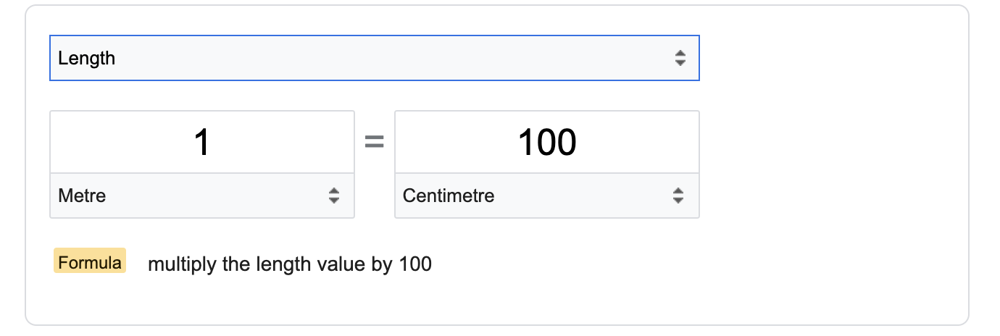

# Project 01: Unit Convertor

Build a Google Unit Convertor using Python and Streamlit:

https://www.google.com/search?q=unit+converter

You will publish the code on [Github](https://github.com/panaversity/learn-modern-ai-python/tree/main/08_github) and also the running streamlit app on the web.

Once you are done submit this form ASAP:

https://forms.gle/tS7C3sr55tUZ36GY8 

You can required to innovate and improve the webapp.

You will also share your published app in your section Discord channel. However, do not share your source code or github repo link anywhere.

You can learn steamlit from here:

https://github.com/panaversity/learn-modern-ai-python/tree/main/03_ui_streamlit
